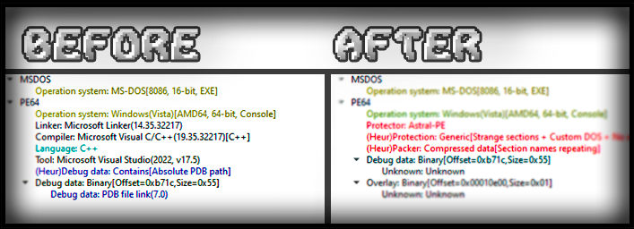
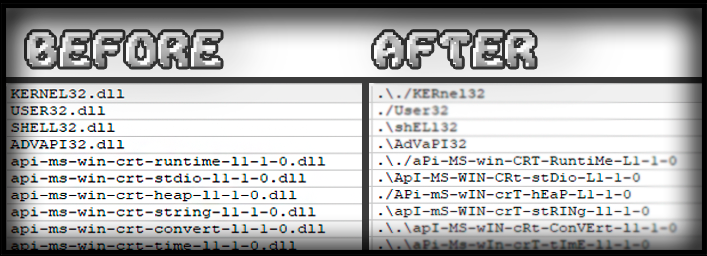
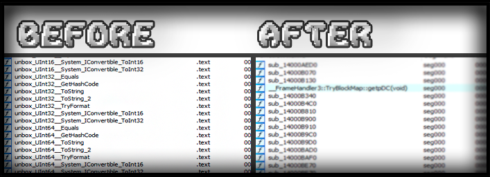
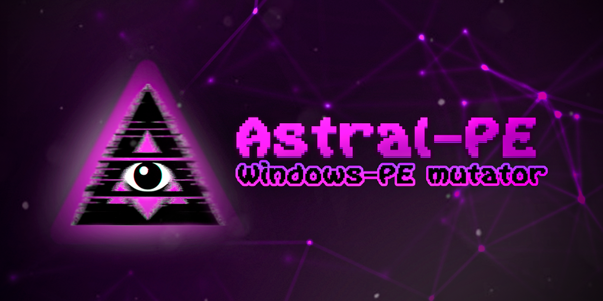

---

Astral-PE is a **low-level mutator** (headers obfuscator and patcher) for Windows PE files (`.exe`, `.dll`) that rewrites structural metadata after compilation (or postbuild protection) — **without breaking execution**.

It **does not pack, encrypt or inject**. Instead, it mutates low-hanging but critical structures like timestamps, headers, section flags, debug info, import/export names, and more.

> #### 🛠 [**Download Astral-PE build for Windows x64**](https://github.com/DosX-dev/Astral-PE/releases/tag/Stable)

## 🔧 In what cases is it useful?

You’ve protected a binary — but public unpackers or YARA rules still target its **unchanged structure**.

> ### 👨🏼‍💻 Use Astral-PE as a **post-processing step** to:
> - Prevent automated unpacking
> - Break static unpacker logic
> - Invalidate reverse-engineering signatures
> - Disrupt clustering in sandboxes
> - Strip metadata, overlays (only if file is signed), debug traces...

> ### 🤩 **Perfect for:**
> - For packed/protected builds (e.g. legacy Enigma)
> - To create your own protector on this base
> - Hardened loaders that remain structurally default
> - To create interesting crackme quests
> - For educational purposes

## ✨ What it modifies

Astral-PE applies precise, compliant, and execution-safe mutations:

| Target                  | Description                                                |
|-------------------------|------------------------------------------------------------|
| 🕓 Timestamp            | Clears `TimeDateStamp` in file headers                    |
| 🧠 Rich Header          | Fully removed — breaks toolchain fingerprinting           |
| 📜 Section Names        | Wiped (`.text`, `.rsrc`, etc. → null)                     |
| 📎 Checksum              | Reset to zero                                             |
| 📦 Overlay              | Stripped if file was signed                               |
| 🧵 TLS Directory        | Removed if unused                                         |
| ⚙ Load Config           | Deleted (if CFG not present)                              |
| 🧬 Relocations          | `.reloc` section removed if not required                  |
| 📋 Version Info         | Erased from optional header                               |
| 📁 Original Filename    | Located and zeroed in binary tail                         |
| 🔎 Debug Info           | PDB paths wiped, Debug Directory erased                   |
| 🚀 Entry Point Patch    | Replaces or shuffles PUSH/PROLOGUE bytes (e.g. UPX)       |
| 🧪 Import Table         | DLL names mutated: case, prefix, randomized formatting    |
| 🏷 Export Table          | Faked if absent (baits certain scanners)                  |
| 📚 Data Directory       | All unused entries cleaned                                |
| 💾 Permissions          | R/W/X + code flags applied to all sections                |
| 📄 DOS Stub             | Reset to clean "MZ", patched `e_lfanew`                   |

📝 **Does not support .NET binaries**. Native PE only.

## 🚀 Usage

```cmd
AstralPE.exe <input.exe> -o <output.exe>
```

- `-o`, `--output` — output file name (optional)
- Default output: `<input>_ast.exe`
- No args? Shows help


## 🧪 Example

```cmd
AstralPE.exe payload.exe -o payload_clean.exe
```

## 📎 Combination with other protections

Use Astral-PE **after** applying protectors.  
Chain it into your CI, cryptor, or loader pipeline:

```
Build → Any packer → AstralPE → Sign / Pack → Distribute
```

## 🔬 What it’s not

- Not a cryptor
- Not a stub injector
- Not a runtime packer
- Not a **code** obfuscator

It’s a **surgical metadata cleaner** and **PE-headers obfuscator** for post-processing protected binaries.

## Before and after
A file compiled via Microsoft Visual C++ was chosen as a sample for demonstration.

> ### File analyzers go crazy.
> Scanned with **[Detect It Easy](https://github.com/horsicq/Detect-It-Easy)**. No reliable verdicts other than the heuristic analysis.
> 

> ### Imports have become mutated.
> This makes it very difficult for all existing PE file analyzers to analyze the file.
> 

> ### No debug data in PE!
> Automatically remove references to PDB files, embedded debug information or other patterns that can simplify analysis (e.g. Rich signature)
> 

---

